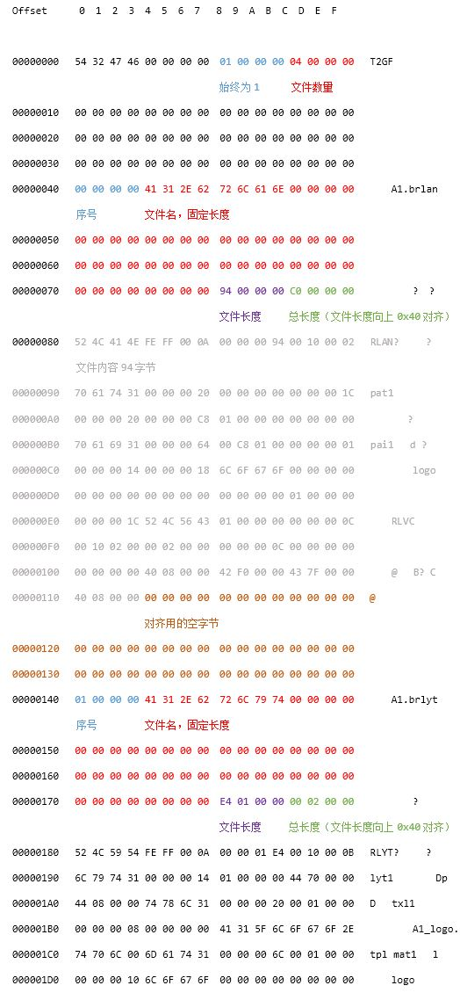

# 银星围棋(PSV) 汉化
## 第一章 解包打包
  
### 得到游戏的pkg文件
  
 安装和配置 [nps brower](https://nopaystation.com/faq) (参照FAQ中的*Configuration and Usage*)，在Option中不要勾选 *Delete files after successful unpack*。
 
 搜索 *Ginsei Igo* 下载得到游戏的 pkg 文件。

### 解包pkg
  
  如果在 nps brower 中配置了 *pkg dec tool*，例如 [pkg2zip](https://github.com/mmozeiko/pkg2zip)，则在下载完pkg文件后，会自动解压出包内文件，但是这些文件还是加密的，需要使用 [psvpfstools](https://github.com/motoharu-gosuto/psvpfstools) 继续解密。

  其实，还有个更简单的方法。使用 PSV 模拟器 [Vita3K](https://github.com/Vita3K/Vita3K) 安装 pkg 文件，安装完后，选择菜单 `File` ==> `Open Pref Path`，在`ux0\app `中会出现一个该游戏“Title ID”的目录，里面的文件都是已经解密好的。
  
  这里面的文件修改后，对于安装有 rePatch 插件的实体机，可以直接放在的 `ux0:/rePatch/[Title ID]` 目录下（保持相同路径），即可生效。
  
  *注: 关于zRIF，可以在 tsv 文件中找，也可以在[网站](https://nopaystation.com/browse)上直接搜索得到。*

### 游戏中的自定义文件

这个游戏的结构还是比较简单的，data下面就5个目录，先用16进制编辑器（推荐 [Winhex](https://tool.kanxue.com/index-detail-33.htm)）随便打开看看，就IMG下面有些我们感兴趣的大文件。文件后缀是.T2G，文件开头是T2GF，上google搜一圈，没有发现现成的文件格式或解包软件，只能自己写解包和打包的工具了。

首先我们要分析出文件的格式，这里没有太多的捷径可循，只能分享一些经验和技巧：
* 可以同时打开多个T2G文件，比较发现其中的不同。最土最方便的是用16进制编辑器打开多个窗口后，来回切换找不到；也可以使用 [WinMerge](https://winmerge.org/)，打开2个文件后，菜单 `文件` ==> `重新比较` ==> `二进制`。
  
* 在 Winhex 中选中文件块，菜单 `编辑` ==> `复制选块` ==> `编辑器显示`，粘贴到 Word 编辑器中，选一个等宽的字体，并调小字号。把分析的结果用不同颜色的字进行标注。（这个方法很土，不知道有没有更方便的工具。）
  

分析的结果如下：

  

### 写一个解包打包的程序

接下来是写解包和打包的程序，有的人喜欢分别写，一个用来解包和一个用来打包；我习惯是写一个类，用 load 函数载入包，save 函数保存包，replace 函数替换包里面的内容，dump/dump_all 导出包里面的内容。
