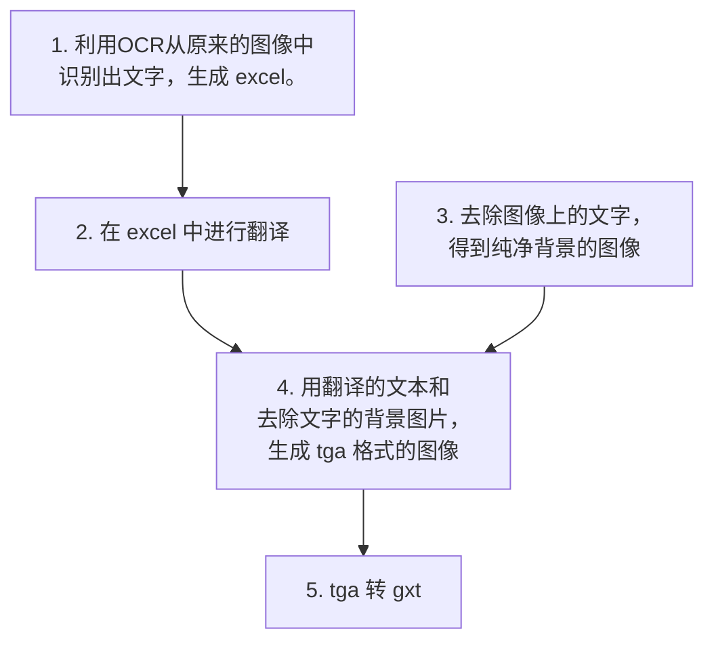
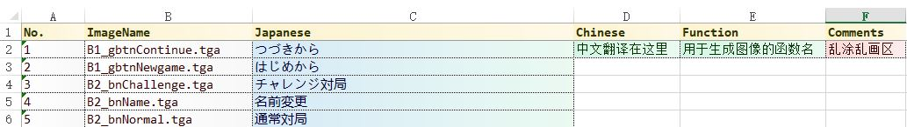
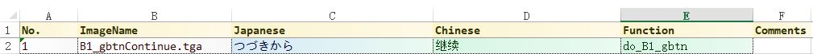

# 银星围棋(PSV) 汉化
## 第二章 处理图像

### 找到图像
在[上一章](chapter_1.md)我们解出的文件中，最多的是以 .gxt 为后缀的文件，用16进制编辑器打开，一看就知道是图像。如果你一眼看不出，说明你的等级还不够，需要汉化更多的游戏，获取更多经验值以提升等级。

### 解出图像
以 "ps vita gxt" 为关键字在 google 上搜索，第一个结果就是转换工具 [GXTConvert](https://github.com/xdanieldzd/GXTConvert)，能够把 gxt 文件转成 png。

不过不知道作者是怎么想的，每次运行结束后都要 Press any key to exit，写的是命令行程序，思维还停留在 GUI。总共有 300 多个 gxt 文件，难道我就要按 300 多次键盘？

好在是开源的，把这个 bug 注释掉；同时还修改了输出的文件名，使得在 gxt 里只有一个图像的时候，输出的文件前缀和原来相同。改好后编译生成 exe。把这个我们自己的GXTConvert.exe，放在 [image](../../Ginsei%20Igo%20Next%20Generation/image/) 目录中。

运行
```bat
for /r %i in ([gxt所在目录]\*.gxt) do GXTConvert "%i"
```

至此，我们就得到了 png 格式的游戏图像。

### 导回图像

网上自行寻找泄露出来的官方 PSV SDK，里面有个工具叫 psp2gxt，用来把 .dds .pvr .tga 格式的图像，转换成 .gxt 格式。

### 处理图像

把含有文字的 png 都复制到[这里](../../Ginsei%20Igo%20Next%20Generation/image/old/)，总共有 260 多张，打包后传给美工。

# 完

</br></br></br></br></br></br></br></br></br></br></br></br></br></br></br></br></br></br></br></br></br></br></br></br></br></br></br>

可能你没有美工，就算有美工，我们也有更好的处理方式。

整个流程是这样的：


如此做的**好处**是，只要写好程序，对于同样样式的图片，提供对应的文本后，就可以**零成本的批量生成**；而且之后可以**随意修改翻译的文本**。如果对出图的颜色等效果不满意，也可以非常方便的**修改添加各种效果**。

***
**第一步**，OCR识别文字并生成 excel。 由程序 [ocr.py](../../Ginsei%20Igo%20Next%20Generation/image/ocr.py) 实现。

关于 OCR 可以使用开源的 [easyocr](https://github.com/JaidedAI/EasyOCR)，即便有识别错误的情况也没关系，这些原始文本之后是没用的，明显错误的可以直接看着图片来翻译。

关于生成 excel 文件，我用了 [openpyxl](https://pypi.org/project/openpyxl/)，并在此基础上写了一个 [translate.py](../../libs/translation.py)。

```python
from translation import Translation
# 定义一个 Translation 类实例
trans = Translation()

# 添加文本
trans.append(
    {
        'ImageName': 'xxx.tga'    # 图像文件名
        'Japanese': 'こんにちは',  # 日语原文
        'Chinese': '',            # 用于
        'Function': '',           # 用于生成图片的函数名
    }
)

# 保存
trans.save('Ginsei Igo Next Generation Images.xlsx', index='Japanese')
```
由于最终需要的是 tga 格式的图片，所以直接就把图片文件后缀改成 .tga 了。

生成出来的 xlsx 文件，在[这里](../../Ginsei%20Igo%20Next%20Generation/image/Ginsei%20Igo%20Next%20Generation%20Images%20Init.xlsx)。



***
**第二步和第三步**，把翻译好的文本，放在 [image](../../Ginsei%20Igo%20Next%20Generation/image/) 下面。

处理好的图片，放在目录 [image\bg](../../Ginsei%20Igo%20Next%20Generation/image/bg/) 下面。

***
**第四步**，用程序来生成图片。由程序 [gen_pic.py](../../Ginsei%20Igo%20Next%20Generation/image/gen_pic.py) 实现。

程序会从 xlsx 中依次读取文本、图片文件名和函数名，然后以文本和文件名作为参数，执行函数。

例如，遇到：


则最终会执行：
```python
MyDrawer.do_B1_gbtn('继续', 'B1_gbtnContinue.tga')
```

MyDrawer.do_B1_gbtn 是这样的：
```python
class MyDrawer(Drawer):
    def do_B1_gbtn(self, text, name):
        image = self.get_image('B1.png')
        size = 192, 40
        font = self.get_font('SourceHanSansCN-Bold.otf', 25)
        im = self.get_text_image(size, font, text, color='#333333', stroke_width=1, blur=2)
        image.paste(im, mask=im)
        im = self.get_text_image(size, font, text)
        image.paste(im, mask=im)
        image.save(name)
```

首先是用 `get_image` 得到背景图，这个函数在父类 `Drawer` 中实现，有 cache 机制。如果参数传入的是字符串文件名，则返回该图片；如果传入的是宽和高，则返回一张该大小的空图片。

`size` 是按钮的大小。


`get_font` 用于得到字体，和 `get_image` 一样，也是在父类 `Drawer` 中实现，也有 cache 机制。

`get_text_image` 用于得到一张文字图片，在父类 `Drawer` 中实现。
```python
    def get_text_image(
        self,
        size,              # 图片大小
        font,              # ImageFont 字体
        text,              # 文本
        halign='center',   # 横向对齐方式，合法值： left, right, center
        valign='center',   # 纵向对齐方式，合法值：top, bottom, center
        italic=False,      # 倾斜
        color='white',     # 文字颜色
        letter_space=1.0,  # 字符间距的比例
        blur=-1,           # 高斯模糊滤镜的参数，小于 0 无效，数值越大越模糊，建议从 2 开始调整
        stroke_width=0,    # 字体描边宽度
        stroke_fill=None,  # 描边颜色
        shear=None,        # 仿射变换参数，控制倾斜率，如设置了italic=True，则固定为0.2
    ):
```
`self.get_text_image(size, font, text, color='#333333', stroke_width=1, blur=2)` 得到的是一张把文字扩大一圈后进行模糊处理的图片，作为文字的外围轮廓：


`self.get_text_image(size, font, text)` 得到是这样一张图片：


把这两张图依次粘贴到背景图上，最终保存得到：


总体思路就是把文字图片不断的往背景上贴。

其中，最复杂的是这张：


文字中的渐变色效果设这样实现的：

```python
    def do_GK_0texS_01(self, text, name):
        ... # 略
        alpha = self.get_text_image(size, font, text, italic=True, letter_space=letter_space, blur=0.5).convert('L')
        im = self.get_degrees_gradient_image(size, ('white', '#999999'), 90)
        im.putalpha(alpha)
        image.paste(im, mask=im)

        image.save(name)
```

先把文字图片转成灰度图像，作为alpha通道；然后利用`get_degrees_gradient_image`生成一张渐变色的图；最后在这张渐变色图上，设置 alpha 通道。
```python
    def get_degrees_gradient_image(
        self,
        size,  # 图片大小
        color_palette,  # 颜色枚举
        degrees=0,  # 渐变角度
    ):
```
其中的 `color_palette` 参数，可以使用 2 种以上的颜色。

***

生成完图片后，用 `check_size` 检查一下是否和原始的图片大小相同；然后用 `gen_gxt` 生成最终的 .gxt 文件。

至此，图像处理完毕。